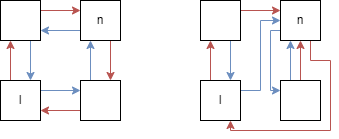
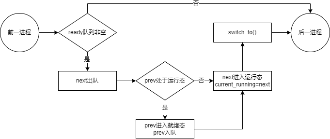

# Project 2
## Part 1
### 代码说明
注：实验前由老师给出、且未作修改的代码不再说明

#### libs/list.c
带有头结点的双向循环链表 API
- 要求头结点`l != NULL`
- 当`l == l->next && l == l->prev`时链表为空
- 具体函数说明：
  * `list_init()`：初始化空链表，即将头结点的`next`和`prev`域设为`l`自身
  * `list_insert()`：在结点`l`后插入结点`n`
  * `list_delete()`：从链表中删除结点`l`
  * `list_is_empty()`：判断链表是否为空

注：由于目前使用该 API 仅是实现 PCB 的 ready 和 block 队列，因此目前的设计非常简陋，对于一些特殊情况，例如：
- `l == NULL`：尝试访问 NULL 的`next`和`prev`域
- 要插入的结点`n`已经在`l`所在链表内：链表指针错乱，如下图所示
  
  (红色为prev，蓝色为next指针)

等情况会出现问题，编写时需要留意

#### include/os/list.h
libs/list.c 的头文件，需要特殊说明两个宏如下：
- `offset_of(tp, mem)`：计算域`mem`在结构体类型`tp`中的以字节为单位的偏移量
- `list_entry(ptr, tp, mem)`：根据成员`mem`的指针`ptr`和结构体类型`tp`计算结构体的指针


#### init/main.c
- `pcb_enqueue()` & `pcb_dequeue()`：对 list API 的一层封装，简单的队列API
- `init_pcb_stack()`：初始化分配给某一 pcb 的栈空间
  * 将初始的返回地址（即用户程序入口地址`entrypoint`）和用户栈指针写入内核栈，以便`switch_to()`使用
- `init_pcb()`：载入所需的用户程序
  1. 宏定义了所需的用户程序名数组`NEEDED_TASKS`，遍历该数组，对每一个所需的任务：
  2. 复用 Project 1 的`get_taskid_by_name()`函数获得其任务 id
  3. 复用 Project 1 的`load_task_img()`函数从镜像中载入任务到内存
  4. 分配内核栈和用户栈
  5. 分配 pid，这里使用了一个全局变量`pid_n`，值为上一个分配出去的 pid
  6. 复制进程名（自行添加的）
  7. 调用`init_pcb_stack()`初始化栈空间
  8. 设置为就绪态，进入`ready_queue`

#### arch/riscv/kernel/entry.S
- `switch_to()`：
  1. 暂存前一pcb的用户栈指针sp
  2. 切换到前一pcb的内核栈
  3. 保存sp、ra、s0~s11
  4. 切换到后一pcb的内核栈
  5. 载入sp、ra、s0~s11
  6. 切换到后一pcb的用户栈
  7. 修改tp为新的current_running

#### kernel/sched/sched.c
调度相关
- `do_scheduler()`：
  
- `do_block()`：将 pcb 加入某一阻塞队列，设为阻塞态，调用调度器
- `do_unblock()`：从某一阻塞队列取出一 pcb，设为就绪态，加入`ready_queue`

#### kernel/locking/lock.c
锁相关
- `do_mutex_lock_init()`：为`key`分配一个锁，返回下标`idx`
  * 当已经有分配给`key`的锁时，直接返回它的下标
  * 否则，将第一个未分配的锁分配给`key`，返回它的下标
  * 若所有锁已分配（分配失败），返回-1
- `do_mutex_lock_acquire()`：尝试获取锁
  * 若获取到，返回
  * 否则，调用`do_block()`将进程阻塞
- `do_mutex_lock_release()`：释放锁
  * 若阻塞队列空，锁的状态改为`UNLOCKED`
  * 否则，调用`do_unblock()`解除一个进程的阻塞

## Part 2
### 代码说明
#### 中断初始化
##### kernel/irq/irq.c: init_exception()
1. 设置中断和异常处理表，目前分别只有`handle_irq_timer()`和`handle_syscall()`有效
2. 调用 setup_exception 设置 stvec 的值为 `exception_handler_entry` 的地址
##### init/main.c: init_syscall()
初始化系统调用表

#### 内核栈初始化
##### init/main.c: init_pcb_stack()
1. 对 part1 中`switch_to_context`的修改：
   `switch_to`初始的 ra 改为`ret_from_exception`而不是应用入口`entrypoint`，以此模拟从中断返回的情形，复用中断返回的恢复寄存器、sret
2. 对`pt_regs`的初始化：
   1. sstatus 初始化为`SR_SPIE`，这样 sret 时硬件将 SPIE 位赋到 SIE 位，使能中断
   2. sepc 初始化为应用入口`entrypoint`，首次 sret 时即可进入用户程序开始运行
   3. sp 初始化为用户程序初始的用户栈地址
   4. tp 初始化为用户程序对应的 pcb 地址

#### 中断处理流程
##### tiny_libc/syscall.c: sys_xxx()
对`invoke_syscall()`的封装，用户程序使用系统调用的入口
##### tiny_libc/syscall.c: invoke_syscall()
1. 将系统调用号存入a7
2. 将参数 arg0 ~ arg4 存入 a0 ~ a4
3. ecall，进入内核态处理中断
4. 从 a0 中获得返回值，返回
##### arch/riscv/kernel/entry.S: exception_handler_entry
1. SAVE_CONTEXT
   1. 保存用户栈指针（即当前的 sp）到当前 pcb 中
   2. 从当前 pcb 载入内核栈指针
   3. 将所有通用寄存器和 sstatus 等中断相关寄存器保存入内核栈
2. 调用`interrupt_helper()`
3. 返回到`ret_from_exception()`
##### kernel/irq/irq.c: interrupt_helper()
根据 scause 查找并调用对应 handler
##### kernel/irq/irq.c: handle_irq_timer()
处理时钟中断：设置下次中断的时间为现在的时间+INTERVAL；调用调度器
##### kernel/syscall/syscall.c: handle_syscall()
1. 从内核栈读取系统调用号和参数
2. 查系统调用表并调用对应 function，将返回值存入内核栈
3. sepc+4，以便sret回到ecall的下一条指令
##### arch/riscv/kernel/entry.S: ret_from_exception
1. RESTORE_CONTEXT
   1. 从内核栈载入除了 sp 和 tp 的所有通用寄存器及 sepc、sstatus
   2. 保存内核栈指针到当前 pcb
   3. 从当前 pcb 载入用户栈指针
2. sret，返回用户态

#### 进程切换
TODO
#### sleep
TODO
#### 抢占式调度
TODO
#### 线程
TODO
#### 其它设计
##### libs/printk.c: logging() & set_loglevel()
对`printl`/`qemu_logging`的封装。按照等级输出格式化的内核日志信息
```
[tick][module][level] msg
```
只需修改初始化时设置的日志等级即可改变日志的详细程度，便于调试
