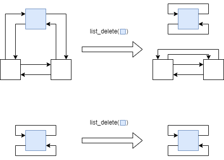

# Project 3
注：已在 Project 2 中解释，且没有大改动的代码（例如新增系统调用时增加`sys_xxx()`,`invoke_syscall()`等）将不再赘述

## 目录
- [Project 3](#project-3)
  - [目录](#目录)
  - [新增系统调用](#新增系统调用)
    - [`do_exec()` / 修改`init_pcb()`和`init_pcb_stack()`](#do_exec--修改init_pcb和init_pcb_stack)
    - [`do_kill()`](#do_kill)
      - [锁资源的回收 `do_mutex_release_f()`](#锁资源的回收-do_mutex_release_f)
      - [从任意队列出队 `list_delete()`](#从任意队列出队-list_delete)
    - [`do_exit()`](#do_exit)
      - [用户程序的退出](#用户程序的退出)
    - [`do_waitpid()`](#do_waitpid)
    - [`do_process_show()`](#do_process_show)
    - [`do_getpid()`](#do_getpid)
    - [`do_taskset()`](#do_taskset)
  - [screen 驱动修改](#screen-驱动修改)
    - [修改`screen_write_ch()`](#修改screen_write_ch)
    - [新增`screen_set_scroll_base()`](#新增screen_set_scroll_base)
    - [新增`screen_move_cursor_r()`](#新增screen_move_cursor_r)
  - [shell 实现](#shell-实现)
    - [获取输入并回显](#获取输入并回显)
      - [`getchar()`](#getchar)
      - [`putchar()`](#putchar)
      - [`backspace()`](#backspace)
      - [`clearline()`](#clearline)
      - [`getline()`](#getline)
    - [历史记录](#历史记录)
      - [`round_add()`](#round_add)
    - [预处理](#预处理)
    - [命令解析](#命令解析)
  - [同步原语](#同步原语)
    - [condition](#condition)
    - [barrier](#barrier)
    - [mailbox](#mailbox)
  - [多核](#多核)
    - [启动](#启动)
      - [bootloader](#bootloader)
      - [head.S](#heads)
      - [main.c](#mainc)
    - [内存分布](#内存分布)
    - [临界区保护](#临界区保护)
    - [其余修改](#其余修改)
    - [绑核](#绑核)

## 新增系统调用
### `do_exec()` / 修改`init_pcb()`和`init_pcb_stack()`
在上个 Project 中，`init_pcb()`会加载所有镜像中的 app 为就绪态。但本次要使用 shell 交互式地加载用户希望加载的 app，因此需要将 id/name 和程序参数传入`init_pcb()`

对于 A/C Core，先用 Project 1 实现的`get_taskid_by_name()`把 name 转化为 id，后续流程相同，基本复用 Project 2的流程完成 pcb 初始化

在`init_pcb_stack()`中，将 argc 赋值到`pt_regs->regs[10]`，这样在第一次`ret_from_exception`时，它便会被加载到 a0 寄存器，用户程序就可以读取到传入参数

对于 S Core，类似地将 arg0~arg2 赋值到 regs[11]~reg[13]；

对于 A/C Core，首先在用户栈上开(argc + 1) * 8字节的空间用于保存 *argv[] 数组，随后依次为每个参数开栈空间、复制参数值、将地址保存到 *argv[] 数组中，最后将 *argv[] 数组的地址赋值到 regs[11]，并将此时的用户栈指针向下128字节对齐后赋值到 pcb->user_sp

若上述过程成功完成，返回 pid，失败返回0

`do_exec()`基本就是对`init_pcb()`的一层封装

### `do_kill()`
遍历 pcb[]，找到未退出（状态不为`TASK_EXITED`）且 pid 相等的进程
- 唤醒等待它的进程
- 回收它持有的锁资源
- 设置状态为`TASK_EXITED`
- 将它从等待队列（ready_queue / sleep_queue / block_queue / wait_list）中出队
- 如果 shell 杀死，重启 shell

#### 锁资源的回收 `do_mutex_release_f()`
强制性地释放一个进程持有的所有锁

在 mutex_t 结构中增加 pid 域，`do_mutex_acquire()`时记录为`current_running->pid`（“一个锁同时至多被一个进程持有”已经由锁的实现保证）

遍历 mutex[]，找到 pid 相等的锁，调用`do_mutex_release()`将其释放

#### 从任意队列出队 `list_delete()`
不使用`pcb_dequeue()`，而是直接使用底层的 list API，该 API 特性如下图所示



输入参数为一个结点，无论该结点处于哪个队列，该 API 都可以将它从队列中删除；若它不处于任何队列，该 API 什么都不会做

待删除结点的`next`和`prev`域的合法性同样由 list API 保证，它们不会是`NULL`或者指向错误的结点

### `do_exit()`
等于进程的自杀，即`do_kill(current_running->pid)`，因此直接复用`do_kill`

随后重新调度`do_scheduler()`

该函数不会返回

#### 用户程序的退出
Project 1 中，用户程序退出时使用如下代码：
```
// finish task and return to the kernel
ld   ra, (sp)
addi sp, sp, 8
jr    ra
```
直接返回了内核，但从 Project 2 开始有了特权级的概念，这里直接返回会产生异常。而 Prj 2 忽略了这个问题（用户程序结束时进入死循环）

现在实现了`do_exit()`，将这里改为：
```
call sys_exit
```
即可实现用户程序的退出

### `do_waitpid()`
遍历 pcb[]，找到 pid 相等的进程
- 若该进程已经退出，直接返回成功
- 若未退出，将自己加入它的 wait_list，重新调度
- 若未找到所需进程，返回失败

### `do_process_show()`
遍历 pcb[]，输出每个进程相关信息

出于美观性考虑，在显示 name 域时，若其长度<=16，正常显示；否则，仅显示前13位和三个`.`

### `do_getpid()`
返回`current_running->pid`

### `do_taskset()`
遍历 pcb[]，找到 pid 相等的进程
- 将其 mask 域赋值为输入的 mask

## screen 驱动修改
### 修改`screen_write_ch()`
为了支持滚屏，修改该函数中，当`ch == '\n'`的逻辑：

当`curser_y`超出`SCREEN_HEIGHT`时，将行数在 [scroll_base+1, SCREEN_HEIGHT) 的字符上移一行（复制到 [scroll_base, SCREEN_HEIGHT-1)，并清空 [SCREEN_HEIGHT-1] 行）

`scroll_base`初始为0，通过[`screen_set_scroll_base()`](#新增screen_set_scroll_base)及对应系统调用修改

### 新增`screen_set_scroll_base()`
设置`scroll_base`

为了更好地支持滚屏，增加该函数及相应的系统调用

### 新增`screen_move_cursor_r()`
根据相对坐标移动光标

为了支持“光标左移一个字符”等功能，从而实现[退格](#backspace)与[清除一行](#clearline)，增加该函数及相应的系统调用

## shell 实现
### 获取输入并回显
#### `getchar()`
与 Project 1 类似，只不过直接的 bios 调用`bios_getch()`换成了进一步封装的系统调用`sys_getchar()`

#### `putchar()`
对`sys_write()`的一层封装，实际效果与`printf("%c", ch);`相同，但性能优于后者

#### `backspace()`
光标左移一位，并删除光标所在处的一个字符（实际上是左移一位后输出一个空格，再重新左移一位）

#### `clearline()`
光标左移至行首，并删除该行内容

#### `getline()`
循环调用`getchar()`读取字符
- 如果是换行符/回车符，返回
- 如果是退格键/删除键，长度-1，调用`backspace()`退格
- 如果是 Ctrl+C，清除改行
- 如果是 Ctrl+D、Ctrl+L 直接返回，[交给`main()`处理](#预处理)
- 如果是上/下方向键，调出[历史记录](#历史记录)；左/右方向键，忽略
- 使用`putchar()`回显

### 历史记录
使用一个循环缓冲区`history[][]`，使用户可以通过上下键快速调出已经执行过的命令

每得到一行有效（非空白）输入，则将 buf 复制到 history[]

当`getline()`解析到上下键时，将 history[] 复制回 buf，并设置 len，刷新屏幕显示

使用`round_add()`简化循环缓冲区的使用

#### `round_add()`
循环加法，即将a+b的结果限制在 [0, lim) 的范围内，若 orig=1 则返回原值，否则返回新值（类似`i++`和`++i`的区别）

### 预处理
得到了一行输入`buf[]`后，先进行一些预处理以便后续使用：
- 首先，判断特殊情况：Ctrl+D 等价于 exit，Ctrl+L 等价于 clear
- 其次，去除两侧多余的空白字符，复用[ Project 1 中实现的`strip()`函数](../Project1_BootLoader/README.md#utilsc)
- 随后，类似 python 中的`str.split()`方法，将每个参数解析到`*argv[]`中

  需要注意，这里只是将每个参数的起始位置的指针记录在`*argv[]`中，以及将每个参数结束的位置改写为`\0`，并不进行参数值的复制（参数值仍保存在`buf[]`中），因此后续使用时应避免修改`buf[]`

例如：
```
// 原始输入
buf[] = " \t exec  waitpid \t&   \0"
// 经过 strip
buf[] = "exec  waitpid \t&\0"
// 经过解析
buf[] = "exec\0 waitpid\0\t&\0"
         ^      ^          ^
*argv[] 依次指向 buf[] 中的 'e', 'w', '&'
```

### 命令解析
经过上面的预处理，只需调用`strcmp()`比较`argv[0]`与欲实现的命令即可实现命令的匹配

ps、clear 等命令的实现都比较简单，相对复杂的是 exec：
- 首先解析最后一个字符是否是`&`，若是，则将 argc 减去1（`&`不作为输入给用户程序的参数）
- 随后将 argv[1] 作为 name（S-Core 则调用`atoi()`转换成 id）
- 将 argv+1 作为新的 *argv[] 传给内核`do_exec()`（S-Core 则分别调用`atoi()`将 argv[2]~argv[4] 转为 int 后传入）

若均匹配失败，则输出`Command not found\n`

## 同步原语
代码见 [kernel/locking/*.c](kernel/locking/)

这些同步原语的原子性[由内核大锁保证](#临界区保护)
### condition
- 初始化、分配都类似互斥锁，不再赘述
- wait：阻塞，释放锁，调度
- signal：若阻塞队列已空，直接返回；否则，释放一个进程
- broadcast：释放阻塞队列中所有进程
- destroy：初始化

需要注意这个 destroy，只是简单地做了初始化，并没有释放阻塞的进程。也就是说，如果仍有进程处于阻塞队列中，条件变量被某个进程 destroy 了，这些被阻塞的进程会永久的处于阻塞状态（除非被 kill）

我认为这种情况应该由用户程序设计者负责避免，而非操作系统保证。理由是：

某一进程等待条件变量唤醒，说明其在设计意图中的某一条件尚未满足（例如读者-写者问题，读者在缓冲区空时等待）

此时若由第三方（例如操作系统）而非另一进程（前例中写者）唤醒，可能会导致它在条件不满足的情况下进入临界区或再次阻塞

前者会导致无法预测的后果，后者会导致使用未分配（已重置）的条件变量，无论是哪种情况都是不合适的

因此一个可以接受的解决方案是让它们继续阻塞下去，留待用户修复（kill）

对于 barrier 的 destroy 也是类似的，下面不再重复

因为相同的理由，在进程退出 / 被 kill 时不会由内核回收它们使用的 condition / barrier

### barrier
- 初始化、分配都类似互斥锁，不再赘述
- wait：now++。若到达goal，释放所有pcb，重置now；若未到达，阻塞，调度
- destroy：初始化

### mailbox
- 初始化、分配都类似互斥锁，只是标识符从`int key`变为了`char *name`，不再赘述
- 使用类似管程的设计思路，用一把互斥锁和两个条件变量（非满、非空）应用在 send 和 recv 中
- 缓冲区`buf[]`循环使用，`size`记录缓冲区中有效字节数，`rp`记录读取位置（则写入位置`wp = (rp + size) % BUFSIZE`）
- send：若缓冲区可用大小不足，`wait(notFull)`；否则，从`wp`开始写入 msg_length 字节，`signal(notEmpty)`
- recv：若缓冲区没有可读内容，`wait(notEmpty)`；否则，从`rp`开始读取 msg_length 字节，`signal(notFull)`
- close：初始化

## 多核
### 启动
#### bootloader
进入时，a0 寄存器的值为核号（bios 保证）

若核号为0，视为主核，与以前一样启动；

否则，视为从核，屏蔽所有中断，将中断服务程序地址设为内核入口，开启软件中断，等待唤醒

#### head.S
从 CSR 寄存器读取核号

若核号为0，与以前一样启动；

否则，无需重置 bss 段，将 sp 设为 KERNEL_STACK + PAGE_SIZE（[见内存分布](#内存分布)），call main

#### main.c
调用`get_current_cpu_id()`获取核号

若核号为0，与以前一样做各种初始化，增加`smp_init()`，初始化完成唤醒从核。由于`send_ipi()`的`mask`无效，故需要在发送核间中断后、开启中断使能前，将自己的SIP寄存器清空：
```
send_ipi(NULL);
asm volatile(
    "csrw %0, zero\n\r"
    :
    : "I" (CSR_SIP)
);
```

否则，只需调用`init_pcb0()`初始化自己的 pcb0、设置 current_running（包含 tp 寄存器的初始化），设置自己的中断和计时器

### 内存分布
双核情况下，内核使用的内存空间示意如下：
```
0x50201000 -------------------------
            内核代码段、数据段、bss段

            内核启动时运行栈（主核）
0x50500000 ------------------------- <- KERNEL_STACK / INIT_KERNEL_STACK
            内核启动时运行栈（从核）
0x50501000 -------------------------
            内核栈（主核）
0x50502000 ------------------------- <- pid0_stack[0]
            内核栈（从核）
0x50503000 ------------------------- <- pid0_stack[1]
            供内核动态分配使用的内存
0x50504000 ------------------------- <- FREEMEM_KERNEL
            供内核动态分配使用的内存
```

### 临界区保护
采用大内核锁（自旋锁）的做法，启动时不涉及临界区的操作，故不获取锁。此后每次进入内核一定是从`exception_handler_entry`，故在此处完成`SAVE_CONTEXT`后获取内核锁；从内核返回时一定通过`ret_from_exception`，在此处进行`RESTORE_CONTEXT`前释放内核锁

### 其余修改
多核运行相比单核而言，一个显著的差异在于，它的 current_running 应该有多个

我采取的方式是直接将 current_running 改为一个数组，将所有使用到它的地方改为`current_running[get_current_cpu_id()]`

与此同时，初始化的内核进程（即pid=0的进程）也有多个，类似地处理 pid0_pcb。由于不同的进程需要不同的内核栈，因此将 pid0_stack 改为数组后手动为其赋初值’
```
const ptr_t pid0_stack[2] = {
    INIT_KERNEL_STACK + 2 * PAGE_SIZE,
    INIT_KERNEL_STACK + 3 * PAGE_SIZE,
};
```

### 绑核
由于我的设计中所有核心共享 ready_queue。在增加了绑核后调度时，不能简单的取队首结点，而应该取第一个 mask 符合要求（`mask & (1 << cpuid) != 0`）的结点

我选择直接修改`pcb_dequeue()`函数，增加一个输入参数为独热编码的 cpuid（相当于是一个 filter）：
```
// 旧：队首出队
pcb_t *pcb_dequeue(list_node_t *queue) {
    pcb_t *pcb = list_entry(queue->next, pcb_t, list);
    list_delete(queue->next);
    return pcb;
}
// 新：首个满足条件的出队
pcb_t *pcb_dequeue(list_node_t *queue, unsigned cid) {
    for (list_node_t *p=queue->next; p!=queue; p=p->next) {
        pcb_t *pcb = list_entry(p, pcb_t, list);
        if (pcb->mask & cid) {
            list_delete(p);
            return pcb;
        }
    }
    return NULL;
}
```

这样，`do_scheduler()`只需调用`pcb_dequeue(&ready_queue, 1 << get_current_cpu_id())`，如果返回NULL，直接 return，否则，按原先的方法调度即可

而其它使用到`pcb_dequeue()`的地方，例如阻塞队列的出队操作，只需让第二个参数为`0xFFFF`便和以前一样了

增加相应的系统调用和命令都比较简单，不再赘述
